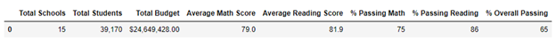
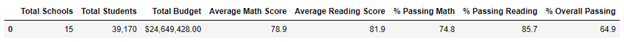

# School District Analysis
Analyzing school district data

## Overview of the school district analysis: Explain the purpose of this 
analysis.

## Results: 
Using bulleted lists and images of DataFrames as support, address the 
following questions:

### How is the district summary affected?
#### Original District Summary

#### New District Summary

#### Effect
After removing the 9th grade testing results from Thomas High School, the passing
percentages for reading, math, and overall testing dropped by a small portion. 
Math dropped by 0.2%, reading by 0.3%, and overall testing dropped by 0.1%. 
### How is the school summary affected?
### How does replacing the ninth graders’ math and reading scores affect 
Thomas High School’s performance relative to the other schools?
### How does replacing the ninth-grade scores affect the following:
- Math and reading scores by grade
- Scores by school spending
- Scores by school size
- Scores by school type

## Summary: 
Summarize four changes in the updated school district analysis after reading
and math scores for the ninth grade at Thomas High School have been replaced 
with NaNs.