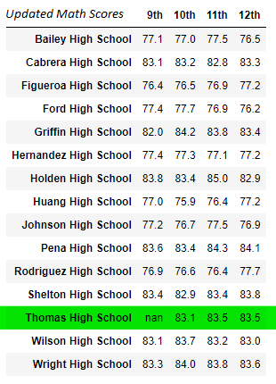
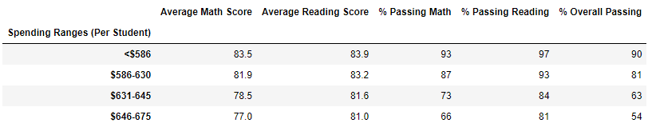
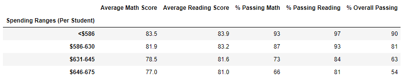
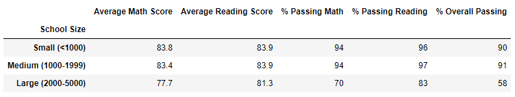
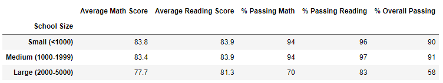
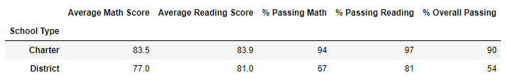
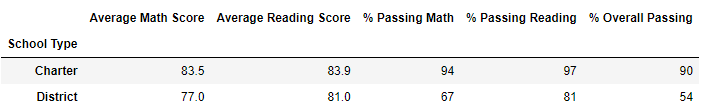

# PyCitySchools with Pandas
Analyzing school district data via Pandas DataFrames

## Overview
The purpose of this analysis is to investigate the effects of removing potentially dishonest scores on the overall district testing outcomes. 

## Resources
- Jupyter Notebook 6.4.5
- students_complete.csv
- schools_complete.csv

## Methods
Using a series of Pandas DataFrames, the given school district data was cleaned and the results were analyzed for changes based on score removal. </br></br>
**Example Data Frame Code Set-Up:** 
```
district_summary_df = pd.DataFrame(
          [{"Total Schools": school_count, 
          "Total Students": student_count, 
          "Total Budget": total_budget,
          "Average Math Score": average_math_score, 
          "Average Reading Score": average_reading_score,
          "% Passing Math": passing_math_percentage,
         "% Passing Reading": passing_reading_percentage,
        "% Overall Passing": overall_passing_percentage}])
```


## Results 

### How is the district summary affected?
#### Original District Summary

#### Updated District Summary

#### Changes Catalogued
After removing the 9th grade testing results from Thomas High School, the passing percentages for reading, math, and overall testing dropped by a small portion. 
- Average MATH score decreased by 0.1 points. 
- Average READING score had no change. 
- Percent of students passing MATH decreased by 0.2%
- Percent of students passing READING decreased by 0.3%
- Percent OVERALL passing dropped by 0.1%. 

### How is the school summary affected?
#### Original School Summary

#### Updated School Summary

#### Changes Catalogued
After removing the 9th grade testing results from Thomas High School, several changes were noted. Almost all categories suffered a small drop in value after 9th grade test scores were removed. 
The only category that increased was the average reading score. 
- The average MATH score decreased by 0.067412 points. 
- The average READING score increased by 0.047152 points. 
- The percentage of students passing MATH decreased by 0.086481%.
- The percentage of students passing READING decreased by 0.29013%. 
- The percentage of students passing OVERALL decreased by -0.317688%. </br>

The only category to experience a positive change after removing 9th grade scores was the category ***Average Reading Score***. All other categories were negatively affected by the removal. 	

### How does replacing the ninth graders’ math and reading scores affect Thomas High School’s performance relative to the other schools?
#### Original Relative Performance

#### Updated Relative Performance 

#### Changes Catalogued
While removing the 9th grade scores did affect Thomas High School's overall test scores, the minute changes did not affect the school's ranking in the district. 
Thomas High School remains the SECOND highest-scoring school in the district, based on their OVERALL passing percent rate. 

### Other Effects of Replacing 9th Grade Scores

#### Math and Reading Scores by Grade
##### Math Scores
 
##### Reading Scores
  
##### Changes Catalogued
After removing Thomas High School's 9th grade scores, no changes were noted in other grade score categories. 

#### Scores by School Spending
##### Original Scores

##### Updated Scores

##### Changes Catalogued
After removing Thomas High School's 9th grade scores, no changes were noted in testing results based on spending bracket. 

#### Scores by School Size
##### Original Scores

##### Updated Scores

##### Changes Catalogued
After removing Thomas High School's 9th grade scores, no changes were noted in testing results based on school size. 

#### Scores by School Type
##### Original Scores

##### Updated Scores

##### Changes Catalogued
After removing Thomas High School's 9th grade scores, no changes were noted in testing results based on school type. 

## Summary 
Removing the Thomas High School 9th grade test scores had several major imacts on the district's overall scores. </br></br>
The district passing percentages for reading, math, and overall testing dropped by a small portion, accounting for four changes in the district summary:
- Average MATH: -0.1 points
- % of student passing MATH: -0.2%
- % of student passing READING: -0.3%
- Percent OVERALL passing: -0.1%</br>

However, despite the changes in Thomas High School's test scores, the school's district ranking was not affected. In addition, district scores based on various metrics (school spending, school size, and school type) had no apparent change. 