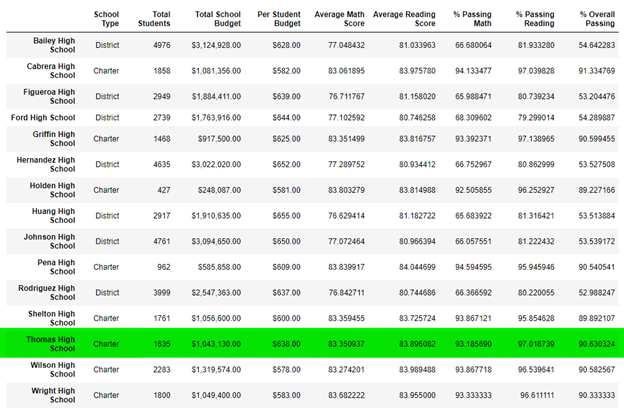
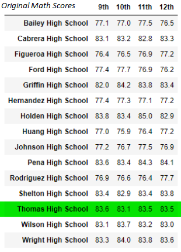
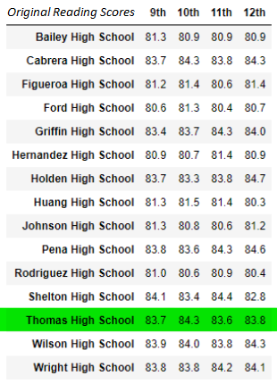

# School District Analysis
Analyzing school district data

## Overview
Explain the purpose of this analysis

## Results 

### How is the district summary affected?
#### Original District Summary

#### Updated District Summary

#### Changes Catalogued
After removing the 9th grade testing results from Thomas High School, the passing
percentages for reading, math, and overall testing dropped by a small portion. 
- Average MATH score decreased by 0.1 points. 
- Average READING score had no change. 
- Percent of students passing MATH decreased by 0.2%
- Percent of students passing READING decreased by 0.3%
- Percent OVERALL passing dropped by 0.1%. 

### How is the school summary affected?
#### Original School Summary

#### Updated School Summary

#### Changes Catalogued
After removing the 9th grade testing results from Thomas High School, several
changes were noted. Almost all categories suffered a small drop in value after
9th grade test scores were removed. The only category that increased was the 
average reading score. 
- The average MATH score dropped from 83.418349 to 83.350937,
 a change of -0.067412 points. 
- The average READING score increased from 83.848930 to 83.896082, 
a change of +0.047152 points. This is the only category of testing 
that results in a positive change after removing 9th grade scores. 
- The percentage of students passing MATH dropped from 
93.272171% to 93.185690%,
a change of -0.086481%.
- The percentage of students passing READING dropped from 
97.308869% to 97.018739%,
a change of -0.29013%. 
- The percentrage of students passing OVERALL decreased from 
90.948012% to 90.630324%, 
a change of -0.317688%. 	

### How does replacing the ninth graders’ math and reading scores affect 
Thomas High School’s performance relative to the other schools?
#### Original Relative Performance

#### Updated Relative Performance 

#### Changes Catalogued
While removing the 9th grade scores did affect Thomas High School's overall test scores, 
the minute changes did not affect the school's ranking in the district. Thomas High School remains
the SECOND highest-scoring school in the district, based on their OVERALL passing percent rate. 

### Other Effects of Replacing 9th Grade Scores
#### Math and reading Scores by Grade
##### Original Math Scores                                        | Updated Math Scores
 | 
##### Updated Math Scores

##### Original Reading Scores

##### Updated Reading Scores

#### Scores by school spending
#### Scores by school size
#### Scores by school type

## Summary 
Summarize four changes in the updated school district analysis after reading
and math scores for the ninth grade at Thomas High School have been replaced 
with NaNs.